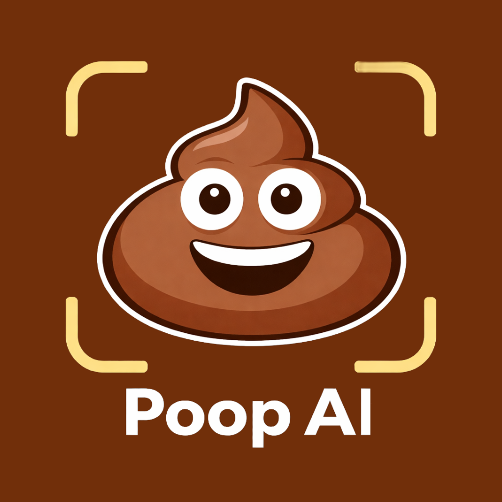

<h1 align="center">
  <br/>
Poop AI </h1>

## Requirements

- [React Native dev environment ](https://reactnative.dev/docs/environment-setup)
- [Node.js LTS release](https://nodejs.org/en/)
- [Git](https://git-scm.com/)
- [Watchman](https://facebook.github.io/watchman/docs/install#buildinstall), required only for macOS or Linux users
- [Pnpm](https://pnpm.io/installation)
- [Cursor](https://www.cursor.com/) or [VS Code Editor](https://code.visualstudio.com/download) ⚠️ Make sure to install all recommended extension from `.vscode/extensions.json`

## 👋 Quick start

Clone the repo to your machine and install deps :

```sh
git clone https://github.com/user/repo-name

cd ./repo-name

pnpm install
```

To run the app on ios

```sh
pnpm ios
```

To run the app on Android

```sh
pnpm android
```

## ✍️ Documentation

## 👨🏼‍🔧 Troubleshooting

-implementation for expo-blur to have the same behavior as react-native-community/blur library
-keep in mind blur on android is experimental and it can cause some issues/crashes

<!-- <BlurView
intensity={100}
experimentalBlurMethod="dimezisBlurView" //!important for android
tint="dark"
style={[StyleSheet.absoluteFill]}
/> -->

<!-- Common error: Your app just crashed. See the error below. java.lang.IllegalStateException: Underflow in restore - more restores than saves android.graphics.Canvas.restore(Canvas.java:663) react native BlurView -->
